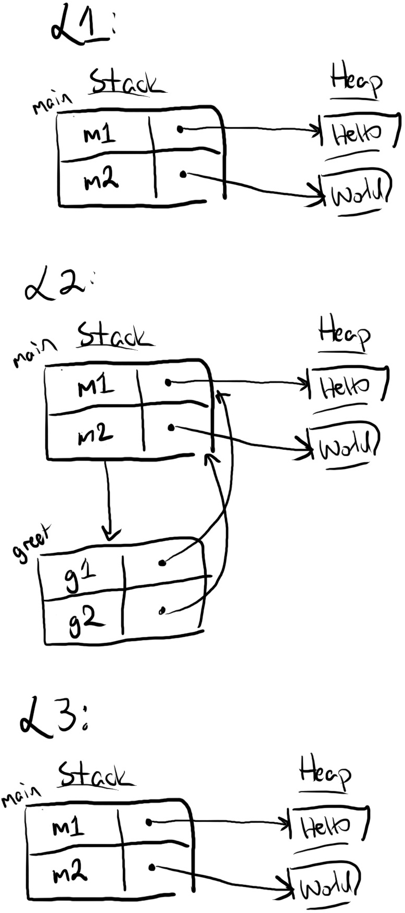

## Tham chiếu (References) và Mượn (Borrowing)

Ownership (Quyền sở hữu), boxes, và moves (di chuyển) cung cấp một nền tảng để lập trình an toàn với heap. Tuy nhiên, các API chỉ cho phép di chuyển (move-only) có thể gây bất tiện khi sử dụng. Ví dụ, giả sử bạn muốn đọc một vài chuỗi ký tự hai lần:

```aquascope,interpreter,shouldFail,horizontal
fn main() {
    let m1 = String::from("Hello");
    let m2 = String::from("world");
    greet(m1, m2);`[]`
    let s = format!("{} {}", m1, m2);`[]` // Error: m1 and m2 are moved
}

fn greet(g1: String, g2: String) {
    println!("{} {}!", g1, g2);`[]`
}
```

Trong ví dụ này, việc gọi `greet` di chuyển dữ liệu từ `m1` và `m2` vào các tham số của `greet`. Cả hai chuỗi đều bị hủy (dropped) ở cuối hàm `greet`, và do đó không thể được sử dụng bên trong `main`. Nếu chúng ta cố gắng đọc chúng như trong thao tác `format!(..)`, thì đó sẽ là hành vi không xác định (undefined behavior). Do đó, trình biên dịch Rust từ chối chương trình này với cùng một lỗi mà chúng ta đã thấy ở phần trước:

```text
error[E0382]: borrow of moved value: `m1`
 --> test.rs:5:30
 (...rest of the error...)
```

Hành vi di chuyển này cực kỳ bất tiện. Các chương trình thường cần sử dụng một chuỗi nhiều hơn một lần. Một cách thay thế là `greet` có thể trả lại quyền sở hữu của các chuỗi, như thế này:

```aquascope,interpreter,horizontal
fn main() {
    let m1 = String::from("Hello");
    let m2 = String::from("world");`[]`
    let (m1_again, m2_again) = greet(m1, m2);
    let s = format!("{} {}", m1_again, m2_again);`[]`
}

fn greet(g1: String, g2: String) -> (String, String) {
    println!("{} {}!", g1, g2);
    (g1, g2)
}
```

Tuy nhiên, phong cách lập trình này khá dài dòng. Rust cung cấp một phong cách ngắn gọn để đọc và ghi mà không cần di chuyển thông qua các tham chiếu (references).

### Tham Chiếu Là Các Con Trỏ Không Sở Hữu (References Are Non-Owning Pointers)

Một **tham chiếu** (reference) là một loại con trỏ. Dưới đây là một ví dụ về một tham chiếu viết lại chương trình `greet` của chúng ta theo cách thuận tiện hơn:

```aquascope,interpreter,horizontal
fn main() {
    let m1 = String::from("Hello");
    let m2 = String::from("world");`[]`
    greet(&m1, &m2);`[]` // note the ampersands
    let s = format!("{} {}", m1, m2);
}

fn greet(g1: &String, g2: &String) { // note the ampersands
    `[]`println!("{} {}!", g1, g2);
}
```

Biểu thức `&m1` sử dụng toán tử và (ampersand) để tạo ra một tham chiếu đến (hoặc "mượn" - borrow) `m1`. Kiểu dữ liệu của tham số `g1` trong `greet` được đổi thành `&String`, nghĩa là "một tham chiếu đến một `String`".

<!-- At runtime, the references look like this:

 -->

Quan sát tại L2 rằng có hai bước từ `g1` đến chuỗi "Hello". `g1` là một tham chiếu trỏ đến `m1` trên stack, và `m1` là một String chứa một box trỏ đến "Hello" trên heap.

Trong khi `m1` sở hữu dữ liệu heap "Hello", `g1` _không_ sở hữu cả `m1` hay "Hello". Do đó sau khi `greet` kết thúc và chương trình đi đến L3, không có dữ liệu heap nào bị giải phóng. Chỉ có stack frame cho `greet` biến mất. Sự thật này nhất quán với _Nguyên tắc Giải phóng Box_ của chúng ta. Bởi vì `g1` đã không sở hữu "Hello", Rust đã không giải phóng "Hello" thay cho `g1`.

Các tham chiếu là **các con trỏ không sở hữu** (non-owning pointers), bởi vì chúng không sở hữu dữ liệu mà chúng trỏ tới.

### Giải Tham Chiếu Một Con Trỏ Để Truy Cập Dữ Liệu Của Nó (Dereferencing a Pointer Accesses Its Data)

Các ví dụ trước sử dụng box và string chưa chỉ ra cách Rust "đi theo" một con trỏ đến dữ liệu của nó. Ví dụ, macro `println!` đã hoạt động một cách bí ẩn cho cả các chuỗi được sở hữu kiểu `String`, và cho các tham chiếu chuỗi kiểu `&String`. Cơ chế bên dưới là toán tử **giải tham chiếu** (dereference), được viết bằng dấu hoa thị (`*`). Ví dụ, đây là một chương trình sử dụng giải tham chiếu theo vài cách khác nhau:

```aquascope,interpreter
# fn main() {
let mut x: Box<i32> = Box::new(1);
let a: i32 = *x;         // *x reads the heap value, so a = 1
*x += 1;                 // *x on the left-side modifies the heap value,
                         //     so x points to the value 2

let r1: &Box<i32> = &x;  // r1 points to x on the stack
let b: i32 = **r1;       // two dereferences get us to the heap value

let r2: &i32 = &*x;      // r2 points to the heap value directly
let c: i32 = *r2;`[]`    // so only one dereference is needed to read it
# }
```

Quan sát sự khác biệt giữa `r1` trỏ đến `x` trên stack, và `r2` trỏ đến giá trị heap `2`.

Bạn có thể sẽ không thấy toán tử giải tham chiếu quá thường xuyên khi đọc code Rust. Rust ngầm định chèn các giải tham chiếu và tham chiếu trong một số trường hợp nhất định, ví dụ như gọi một phương thức với toán tử dấu chấm. Ví dụ, chương trình này hiển thị hai cách tương đương để gọi các hàm [`i32::abs`](https://doc.rust-lang.org/std/primitive.i32.html#method.abs) (giá trị tuyệt đối) và [`str::len`](https://doc.rust-lang.org/std/primitive.str.html#method.len) (độ dài chuỗi):

```rust,ignore
# fn main()  {
let x: Box<i32> = Box::new(-1);
let x_abs1 = i32::abs(*x); // explicit dereference
let x_abs2 = x.abs();      // implicit dereference
assert_eq!(x_abs1, x_abs2);

let r: &Box<i32> = &x;
let r_abs1 = i32::abs(**r); // explicit dereference (twice)
let r_abs2 = r.abs();       // implicit dereference (twice)
assert_eq!(r_abs1, r_abs2);

let s = String::from("Hello");
let s_len1 = str::len(&s); // explicit reference
let s_len2 = s.len();      // implicit reference
assert_eq!(s_len1, s_len2);
# }
```

Ví dụ này cho thấy các chuyển đổi ngầm định theo ba cách:

1. Hàm `i32::abs` mong đợi một đầu vào kiểu `i32`. Để gọi `abs` với một `Box<i32>`, bạn có thể giải tham chiếu box một cách tường minh như `i32::abs(*x)`. Bạn cũng có thể giải tham chiếu box một cách ngầm định bằng cách dùng cú pháp gọi phương thức như `x.abs()`. Cú pháp dấu chấm là cú pháp tiện ích (syntactic sugar) cho cú pháp gọi hàm.

2. Sự chuyển đổi ngầm định này hoạt động cho nhiều lớp con trỏ. Ví dụ, gọi `abs` trên một tham chiếu đến một box `r: &Box<i32>` sẽ chèn vào hai lần giải tham chiếu.

3. Sự chuyển đổi này cũng hoạt động theo chiều ngược lại. Hàm `str::len` mong đợi một tham chiếu `&str`. Nếu bạn gọi `len` trên một `String` được sở hữu, thì Rust sẽ chèn một toán tử mượn đơn lẻ. (Thực tế, có một sự chuyển đổi xa hơn từ `String` sang `str`!)

Chúng ta sẽ nói thêm về các lời gọi phương thức và chuyển đổi ngầm định trong các chương sau. Hiện tại, điều quan trọng cần nhớ là những chuyển đổi này đang diễn ra với các lời gọi phương thức và một số macro như `println`. Chúng tôi muốn làm sáng tỏ tất cả "ma thuật" của Rust để bạn có thể có một mô hình tư duy rõ ràng về cách Rust hoạt động.

{{#quiz ../quizzes/ch04-02-references-sec1-basics.toml}}

### Rust Tránh Việc Vừa Aliasing Vừa Mutation Cùng Lúc

Các con trỏ là một tính năng mạnh mẽ và nguy hiểm bởi vì chúng cho phép **aliasing** (tạo bí danh). Aliasing là việc truy cập cùng một dữ liệu thông qua các biến khác nhau. Tự bản thân nó, aliasing là vô hại. Nhưng khi kết hợp với **mutation** (sự thay đổi/đột biến), chúng ta có một công thức cho thảm họa. Một biến có thể "rút ván" biến khác theo nhiều cách, ví dụ:

-   Bằng cách giải phóng dữ liệu đang được alias, để lại biến kia trỏ vào vùng nhớ đã bị giải phóng.
-   Bằng cách thay đổi dữ liệu đang được alias, làm mất hiệu lực các thuộc tính runtime mà biến kia mong đợi.
-   Bằng cách thay đổi dữ liệu đang được alias _một cách đồng thời_ (concurrently), gây ra data race (xung đột dữ liệu) với hành vi không xác định cho biến kia.

Như một ví dụ xuyên suốt, chúng ta sẽ xem xét các chương trình sử dụng cấu trúc dữ liệu vector, [`Vec`]. Không giống như mảng có độ dài cố định, vector có độ dài thay đổi được bằng cách lưu trữ các phần tử của chúng trong heap. Ví dụ, [`Vec::push`] thêm một phần tử vào cuối một vector, như thế này:

```aquascope,interpreter,horizontal
#fn main() {
let mut v: Vec<i32> = vec![1, 2, 3];`[]`
v.push(4);`[]`
#}
```

Macro `vec!` tạo ra một vector với các phần tử nằm trong dấu ngoặc vuông. Vector `v` có kiểu `Vec<i32>`. Cú pháp `<i32>` có nghĩa là các phần tử của vector có kiểu `i32`.

Một chi tiết cài đặt quan trọng là `v` cấp phát một mảng heap với một _sức chứa_ (capacity) nhất định. Chúng ta có thể nhìn vào bên trong của `Vec` và tự mình thấy chi tiết này:

```aquascope,interpreter,horizontal,concreteTypes
#fn main() {
let mut v: Vec<i32> = vec![1, 2, 3];`[]`
#}
```

> _Lưu ý:_ nhấp vào biểu tượng ống nhòm ở góc trên bên phải của sơ đồ để bật chế độ xem chi tiết này trong bất kỳ sơ đồ runtime nào.

Lưu ý rằng vector có độ dài (`len`) là 3 và sức chứa (`cap`) là 3. Vector đang ở mức tối đa sức chứa. Vì vậy khi chúng ta thực hiện `push`, vector phải tạo một cấp phát mới với sức chứa lớn hơn, sao chép tất cả các phần tử sang, và giải phóng mảng heap ban đầu. Trong sơ đồ trên, mảng `1 2 3 4` nằm ở một vị trí bộ nhớ (có khả năng) khác so với mảng ban đầu `1 2 3`.

Để liên kết điều này trở lại với an toàn bộ nhớ, hãy đưa các tham chiếu vào. Giả sử chúng ta tạo một tham chiếu đến dữ liệu heap của một vector. Sau đó tham chiếu đó có thể bị làm mất hiệu lực bởi một lệnh push, như được mô phỏng dưới đây:

```aquascope,interpreter,shouldFail,horizontal
#fn main() {
let mut v: Vec<i32> = vec![1, 2, 3];
let num: &i32 = &v[2];`[]`
v.push(4);`[]`
println!("Third element is {}", *num);`[]`
#}
```

Ban đầu, `v` trỏ đến một mảng với 3 phần tử trên heap. Sau đó `num` được tạo ra như một tham chiếu đến phần tử thứ ba, như thấy ở L1. Tuy nhiên, thao tác `v.push(4)` thay đổi kích thước `v`. Việc thay đổi kích thước sẽ giải phóng mảng trước đó và cấp phát một mảng mới, lớn hơn. Trong quá trình đó, `num` bị bỏ lại và trỏ đến bộ nhớ không hợp lệ. Do đó tại L3, việc giải tham chiếu `*num` đọc bộ nhớ không hợp lệ, gây ra hành vi không xác định.

Nói một cách trừu tượng hơn, vấn đề là vector `v` vừa bị alias (bởi tham chiếu `num`) và vừa bị thay đổi (bởi thao tác `v.push(4)`). Vì vậy để tránh những loại vấn đề này, Rust tuân theo một nguyên tắc cơ bản:

> **Nguyên tắc An toàn Con trỏ**: dữ liệu không bao giờ được phép vừa bị alias vừa bị thay đổi cùng một lúc.

Dữ liệu có thể bị alias. Dữ liệu có thể bị thay đổi. Nhưng dữ liệu không thể _vừa_ bị alias _vừa_ bị thay đổi. Ví dụ, Rust thực thi nguyên tắc này cho các box (con trỏ sở hữu) bằng cách không cho phép aliasing. Việc gán một box từ biến này sang biến khác sẽ di chuyển quyền sở hữu, làm mất hiệu lực biến trước đó. Dữ liệu được sở hữu chỉ có thể được truy cập thông qua chủ sở hữu &mdash; không có alias.

Tuy nhiên, bởi vì các tham chiếu là các con trỏ không sở hữu, chúng cần các quy tắc khác với box để đảm bảo _Nguyên tắc An toàn Con trỏ_. Theo thiết kế, các tham chiếu được dùng để tạo các alias tạm thời. Trong phần còn lại của mục này, chúng tôi sẽ giải thích những điều cơ bản về cách Rust đảm bảo sự an toàn của các tham chiếu thông qua **bộ kiểm tra mượn (borrow checker).**

### Tham Chiếu Thay Đổi Các Quyền Hạn Trên Các Place (References Change Permissions on Places)

Ý tưởng cốt lõi đằng sau bộ kiểm tra mượn là các biến có ba loại **quyền hạn** (permissions) trên dữ liệu của chúng:

-   **Read** (Đọc) (@Perm{read}): dữ liệu có thể được sao chép đến vị trí khác.
-   **Write** (Ghi) (@Perm{write}): dữ liệu có thể được thay đổi (mutated).
-   **Own** (Sở hữu) (@Perm{own}): dữ liệu có thể được di chuyển (moved) hoặc hủy (dropped).

Các quyền hạn này không tồn tại khi chạy (runtime), chỉ tồn tại bên trong trình biên dịch. Chúng mô tả cách trình biên dịch "suy nghĩ" về chương trình của bạn trước khi chương trình được thực thi.

Mặc định, một biến có quyền đọc/sở hữu (@Perm{read}@Perm{own}) trên dữ liệu của nó. Nếu một biến được chú thích với `let mut`, thì nó cũng có quyền ghi (@Perm{write}). Ý tưởng chính là **các tham chiếu có thể tạm thời loại bỏ các quyền hạn này.**

Để minh họa ý tưởng này, hãy xem xét các quyền hạn trên một biến thể của chương trình trên mà thực sự an toàn. Lệnh `push` đã được chuyển xuống sau lệnh `println!`. Các quyền hạn trong chương trình này được trực quan hóa với một loại sơ đồ mới. Sơ đồ hiển thị những thay đổi về quyền hạn trên mỗi dòng.

```aquascope,permissions,stepper
#fn main() {
let mut v: Vec<i32> = vec![1, 2, 3];
let num: &i32 = &v[2];
println!("Third element is {}", *num);
v.push(4);
#}
```

Hãy đi qua từng dòng:

1. Sau `let mut v = (...)`, biến `v` đã được khởi tạo (biểu thị bởi <i class="fa fa-level-up"></i>). Nó nhận được các quyền @Perm[gained]{read}@Perm[gained]{write}@Perm[gained]{own} (dấu cộng biểu thị sự nhận thêm).
2. Sau `let num = &v[2]`, dữ liệu trong `v` đã được **mượn** (borrowed) bởi `num` (biểu thị bởi <i class="fa fa-arrow-right"></i>). Ba điều xảy ra:
    - Việc mượn loại bỏ các quyền @Perm[lost]{write}@Perm[lost]{own} khỏi `v` (dấu gạch chéo biểu thị sự mất đi). `v` không thể được ghi hoặc sở hữu, nhưng nó vẫn có thể được đọc.
    - Biến `num` đã nhận được các quyền @Perm{read}@Perm{own}. `num` không thể ghi được (quyền @Perm{write} bị thiếu được hiển thị như một dấu gạch ngang <span class="perm write">‒</span>) bởi vì nó không được đánh dấu `let mut`.
    - **Place** (vị trí/vùng nhớ) `*num` đã nhận được quyền @Perm{read}.
3. Sau `println!(...)`, thì `num` không còn được sử dụng nữa, nên `v` không còn bị mượn. Do đó:
    - `v` lấy lại các quyền @Perm{write}@Perm{own} của nó (biểu thị bởi <i class="fa fa-rotate-left"></i>).
    - `num` và `*num` đã mất tất cả các quyền của chúng (biểu thị bởi <i class="fa fa-level-down"></i>).
4. Sau `v.push(4)`, thì `v` không còn được sử dụng nữa, và nó mất tất cả các quyền của nó.

Tiếp theo, hãy khám phá một vài sắc thái của sơ đồ. Đầu tiên, tại sao bạn thấy cả `num` và `*num`? Bởi vì truy cập dữ liệu thông qua một tham chiếu không giống như thao tác trên chính tham chiếu đó. Ví dụ, giả sử chúng ta khai báo một tham chiếu đến một số với `let mut`:

```aquascope,permissions,stepper
#fn main() {
let x = 0;
let mut x_ref = &x;
# println!("{x_ref} {x}");
#}
```

Lưu ý rằng `x_ref` có quyền @Perm{write}, trong khi `*x_ref` thì không. Điều đó có nghĩa là chúng ta có thể gán một tham chiếu khác cho biến `x_ref` (ví dụ `x_ref = &y`), nhưng chúng ta không thể thay đổi dữ liệu mà nó trỏ tới (ví dụ `*x_ref += 1`).

Tổng quát hơn, các quyền hạn được định nghĩa trên các **place** (vị trí/vùng nhớ) chứ không chỉ các biến. Một place là bất cứ thứ gì bạn có thể đặt ở phía bên trái của một phép gán. Các place bao gồm:

-   Các biến, như `a`.
-   Các giải tham chiếu của các place, như `*a`.
-   Các truy cập mảng của các place, như `a[0]`.
-   Các trường của các place, như `a.0` cho tuple hoặc `a.field` cho struct (được thảo luận ở chương sau).
-   Bất kỳ sự kết hợp nào của những thứ trên, như `*((*a)[0].1)`.

Thứ hai, tại sao các place mất quyền hạn khi chúng trở nên không được sử dụng? Bởi vì một số quyền hạn loại trừ lẫn nhau. Nếu bạn viết `num = &v[2]`, thì `v` không thể bị thay đổi hoặc bị hủy trong khi `num` đang được sử dụng. Nhưng điều đó không có nghĩa là việc sử dụng `num` một lần nữa là không hợp lệ. Ví dụ, nếu chúng ta thêm một `println!` khác vào chương trình trên, thì `num` đơn giản là mất quyền hạn của nó trễ hơn một dòng:

```aquascope,permissions,stepper
#fn main() {
let mut v: Vec<i32> = vec![1, 2, 3];
let num: &i32 = &v[2];
println!("Third element is {}", *num);
println!("Again, the third element is {}", *num);
v.push(4);
#}
```

Vấn đề chỉ xảy ra nếu bạn cố gắng sử dụng `num` một lần nữa _sau khi_ thay đổi `v`. Hãy xem xét điều này chi tiết hơn.

### Bộ Kiểm Tra Mượn Tìm Các Vi Phạm Quyền Hạn (The Borrow Checker Finds Permission Violations)

Hãy nhớ lại _Nguyên tắc An toàn Con trỏ_: dữ liệu không nên bị alias và bị thay đổi. Mục tiêu của các quyền hạn này là đảm bảo rằng dữ liệu không thể bị thay đổi nếu nó đang bị alias. Việc tạo một tham chiếu đến dữ liệu ("mượn" nó) làm cho dữ liệu đó tạm thời chỉ đọc được cho đến khi tham chiếu không còn được sử dụng.

Rust sử dụng các quyền hạn này trong **bộ kiểm tra mượn** (borrow checker) của nó. Bộ kiểm tra mượn tìm kiếm các thao tác có khả năng không an toàn liên quan đến tham chiếu. Hãy quay lại chương trình không an toàn chúng ta đã thấy trước đó, nơi `push` làm mất hiệu lực một tham chiếu. Lần này chúng ta sẽ thêm một khía cạnh khác vào sơ đồ quyền hạn:

```aquascope,permissions,boundaries,stepper,shouldFail
#fn main() {
let mut v: Vec<i32> = vec![1, 2, 3];
let num: &i32 = &v[2];`{}`
v.push(4);`{}`
println!("Third element is {}", *num);
#}
```

Bất cứ khi nào một place được sử dụng, Rust mong đợi place đó có các quyền hạn nhất định tùy thuộc vào thao tác. Ví dụ, việc mượn `&v[2]` yêu cầu rằng `v` phải có thể đọc được. Do đó quyền @Perm{read} được hiển thị giữa thao tác `&` và place `v`. Chữ cái được tô đầy bởi vì `v` có quyền đọc tại dòng đó.

Ngược lại, thao tác thay đổi `v.push(4)` yêu cầu rằng `v` phải có thể đọc và ghi được. Cả @Perm{read} và @Perm{write} đều được hiển thị. Tuy nhiên, `v` không có quyền ghi (nó đang bị mượn bởi `num`). Vì vậy chữ cái @Perm[missing]{write} bị rỗng, biểu thị rằng quyền ghi được _mong đợi_ nhưng `v` không có nó.

Nếu bạn cố gắng biên dịch chương trình này, trình biên dịch Rust sẽ trả về lỗi sau:

```text
error[E0502]: cannot borrow `v` as mutable because it is also borrowed as immutable
 --> test.rs:4:1
  |
3 | let num: &i32 = &v[2];
  |                  - immutable borrow occurs here
4 | v.push(4);
  | ^^^^^^^^^ mutable borrow occurs here
5 | println!("Third element is {}", *num);
  |                                 ---- immutable borrow later used here
```

Thông báo lỗi giải thích rằng `v` không thể bị thay đổi trong khi tham chiếu `num` đang được sử dụng. Đó là lý do ở cấp độ bề mặt &mdash; vấn đề cơ bản là `num` có thể bị làm mất hiệu lực bởi `push`. Rust bắt được khả năng vi phạm an toàn bộ nhớ đó.

### Tham Chiếu Khả Biến (Mutable) Cung Cấp Quyền Truy Cập Duy Nhất và Không Sở Hữu (Non-Owning) Đến Dữ Liệu

Các tham chiếu chúng ta đã thấy cho đến nay là các **tham chiếu bất biến** (immutable references) chỉ đọc (còn được gọi là **tham chiếu chia sẻ** - shared references). Các tham chiếu bất biến cho phép aliasing nhưng không cho phép thay đổi. Tuy nhiên, việc tạm thời cung cấp quyền truy cập thay đổi đến dữ liệu mà không cần di chuyển nó cũng rất hữu ích.

Cơ chế cho việc này là **tham chiếu khả biến** (mutable references) (còn được gọi là **tham chiếu duy nhất** - unique references). Dưới đây là một ví dụ đơn giản về một tham chiếu khả biến với các thay đổi quyền hạn đi kèm:

```aquascope,permissions,stepper,boundaries
#fn main() {
let mut v: Vec<i32> = vec![1, 2, 3];
let num: &mut i32 = &mut v[2];
*num += 1;
println!("Third element is {}", *num);
println!("Vector is now {:?}", v);
#}
```

<blockquote><div style="margin-block-start: 1em; margin-block-end: 1em"><i>Lưu ý:</i> khi các quyền hạn mong đợi không thực sự liên quan đến một ví dụ, chúng tôi sẽ viết tắt chúng thành các dấu chấm như <div class="permission-stack stack-size-2"><div class="perm read"><div class="small">•</div><div class="big">R</div></div><div class="perm write"><div class="small">•</div><div class="big">W</div></div></div>. Bạn có thể di chuột qua các vòng tròn (hoặc chạm vào trên màn hình cảm ứng) để xem các chữ cái quyền hạn tương ứng.</div></blockquote>

Một tham chiếu khả biến được tạo bằng toán tử `&mut`. Kiểu của `num` được viết là `&mut i32`. So với các tham chiếu bất biến, bạn có thể thấy hai sự khác biệt quan trọng trong các quyền hạn:

1. Khi `num` là một tham chiếu bất biến, `v` vẫn có quyền @Perm{read}. Bây giờ khi `num` là một tham chiếu khả biến, `v` đã mất _tất cả_ các quyền trong khi `num` đang được sử dụng.
2. Khi `num` là một tham chiếu bất biến, place `*num` chỉ có quyền @Perm{read}. Bây giờ khi `num` là một tham chiếu khả biến, `*num` cũng đã nhận được quyền @Perm{write}.

Quan sát thứ nhất là điều làm cho các tham chiếu khả biến _an toàn_. Các tham chiếu khả biến cho phép thay đổi nhưng ngăn chặn aliasing. Place được mượn `v` trở nên tạm thời không sử dụng được, do đó thực sự không phải là một alias.

Quan sát thứ hai là điều làm cho các tham chiếu khả biến _hữu ích_. `v[2]` có thể được thay đổi thông qua `*num`. Ví dụ, `*num += 1` thay đổi `v[2]`. Lưu ý rằng `*num` có quyền @Perm{write}, nhưng `num` thì không. `num` đề cập đến chính tham chiếu khả biến đó, ví dụ `num` không thể được gán lại cho một tham chiếu khả biến _khác_.

Các tham chiếu khả biến cũng có thể tạm thời bị "hạ cấp" thành các tham chiếu chỉ đọc. Ví dụ:

```aquascope,permissions,stepper,boundaries
#fn main() {
let mut v: Vec<i32> = vec![1, 2, 3];
let num: &mut i32 = &mut v[2];`(focus,paths:*num)`
let num2: &i32 = &*num;`(focus,paths:*num)`
println!("{} {}", *num, *num2);
#}
```

> _Lưu ý:_ khi các thay đổi quyền hạn không liên quan đến ví dụ, chúng tôi sẽ ẩn chúng đi. Bạn có thể xem các bước bị ẩn bằng cách nhấp vào "»", và bạn có thể xem các quyền hạn bị ẩn trong một bước bằng cách nhấp vào "● ● ●".

Trong chương trình này, việc mượn `&*num` loại bỏ quyền @Perm{write} khỏi `*num` nhưng _không_ loại bỏ quyền @Perm{read}, vì vậy `println!(..)` có thể đọc cả `*num` và `*num2`.

### Các Quyền Hạn Được Trả Lại Khi Kết Thúc Lifetime Của Một Tham Chiếu

Chúng tôi đã nói ở trên rằng một tham chiếu thay đổi các quyền hạn trong khi nó đang "được sử dụng". Cụm từ "được sử dụng" đang mô tả **lifetime** (vòng đời) của một tham chiếu, hoặc phạm vi code kéo dài từ lúc sinh ra (nơi tham chiếu được tạo) đến lúc chết (lần cuối cùng tham chiếu được sử dụng).

Ví dụ, trong chương trình này, lifetime của `y` bắt đầu với `let y = &x`, và kết thúc với `let z = *y`:

```aquascope,permissions,stepper,boundaries
#fn main() {
let mut x = 1;
let y = &x;`(focus,paths:x)`
let z = *y;`(focus,paths:x)`
x += z;
#}
```

Quyền @Perm{write} trên `x` được trả lại cho `x` sau khi lifetime của `y` đã kết thúc, giống như chúng ta đã thấy trước đây.

Trong các ví dụ trước, một lifetime là một vùng code liên tục. Tuy nhiên, một khi chúng ta đưa vào luồng điều khiển (control flow), điều này không nhất thiết phải đúng. Ví dụ, đây là một hàm viết hoa ký tự đầu tiên trong một vector các ký tự ASCII:

```aquascope,permissions,stepper,boundaries
fn ascii_capitalize(v: &mut Vec<char>) {
    let c = &v[0];`(focus,paths:*v)`
    if c.is_ascii_lowercase() {
        let up = c.to_ascii_uppercase();`(focus,paths:*v)`
        v[0] = up;
    } else {`(focus,paths:*v)`
        println!("Already capitalized: {:?}", v);
    }
}
```

Biến `c` có một lifetime khác nhau trong mỗi nhánh của câu lệnh if. Trong khối then, `c` được sử dụng trong biểu thức `c.to_ascii_uppercase()`. Do đó `*v` không lấy lại quyền @Perm{write} cho đến sau dòng đó.

Tuy nhiên, trong khối else, `c` không được sử dụng. `*v` ngay lập tức lấy lại quyền @Perm{write} khi vào khối else.

{{#quiz ../quizzes/ch04-02-references-sec2-perms.toml}}

### Dữ Liệu Phải Sống Lâu Hơn (Outlive) Tất Cả Các Tham Chiếu Đến Nó

Là một phần của _Nguyên tắc An toàn Con trỏ_, bộ kiểm tra mượn bắt buộc rằng **dữ liệu phải sống lâu hơn bất kỳ tham chiếu nào đến nó.** Rust thực thi thuộc tính này theo hai cách. Cách đầu tiên xử lý các tham chiếu được tạo và hủy trong phạm vi của một hàm đơn lẻ. Ví dụ, giả sử chúng ta cố gắng hủy một chuỗi trong khi đang giữ một tham chiếu đến nó:

```aquascope,permissions,stepper,boundaries,shouldFail
#fn main() {
let s = String::from("Hello world");
let s_ref = &s;`(focus,rxpaths:s$)`
drop(s);`{}`
println!("{}", s_ref);
#}
```

Để bắt những loại lỗi này, Rust sử dụng các quyền hạn mà chúng ta đã thảo luận. Việc mượn `&s` loại bỏ quyền @Perm{own} khỏi `s`. Tuy nhiên, `drop` mong đợi quyền @Perm{own}, dẫn đến sự không khớp quyền hạn.

Ý tưởng chính là trong ví dụ này, Rust biết `s_ref` sống bao lâu. Nhưng Rust cần một cơ chế thực thi khác khi nó không biết một tham chiếu sống bao lâu. Cụ thể, khi các tham chiếu là đầu vào của một hàm, hoặc đầu ra từ một hàm. Ví dụ, đây là một hàm an toàn trả về một tham chiếu đến phần tử đầu tiên trong một vector:

```aquascope,permissions,boundaries,showFlows
fn first(strings: &Vec<String>) -> &String {
    let s_ref = &strings[0];
    s_ref`{}`
}
```

Đoạn code này giới thiệu một loại quyền hạn mới, quyền luồng (flow permission) @Perm{flow}. Quyền @Perm{flow} được mong đợi bất cứ khi nào một biểu thức sử dụng một tham chiếu đầu vào (như `&strings[0]`), hoặc trả về một tham chiếu đầu ra (như `return s_ref`).

Không giống như các quyền @Perm{read}@Perm{write}@Perm{own}, quyền @Perm{flow} không thay đổi trong suốt thân hàm. Một tham chiếu có quyền @Perm{flow} nếu nó được phép sử dụng (nghĩa là, được phép _flow_ - chảy) trong một biểu thức cụ thể. Ví dụ, giả sử chúng ta đổi `first` thành một hàm mới `first_or` bao gồm một tham số `default`:

```aquascope,permissions,boundaries,showFlows,shouldFail
fn first_or<'a, 'b, 'c>(strings: &'a Vec<String>, default: &'b String) -> &'c String {
    if strings.len() > 0 {
        &strings[0]`{}`
    } else {
        default`{}`
    }
}
```

Hàm này không còn biên dịch được nữa, bởi vì các biểu thức `&strings[0]` và `default` thiếu quyền @Perm{flow} cần thiết để được trả về. Nhưng tại sao? Rust đưa ra lỗi sau:

```text
error[E0106]: missing lifetime specifier
 --> test.rs:1:57
  |
1 | fn first_or(strings: &Vec<String>, default: &String) -> &String {
  |                      ------------           -------     ^ expected named lifetime parameter
  |
  = help: this function's return type contains a borrowed value, but the signature does not say whether it is borrowed from `strings` or `default`
```

Thông báo "missing lifetime specifier" (thiếu chỉ định lifetime) hơi bí ẩn, nhưng thông báo trợ giúp cung cấp một số ngữ cảnh hữu ích. Nếu Rust _chỉ_ nhìn vào chữ ký hàm, nó không biết liệu đầu ra `&String` là một tham chiếu đến `strings` hay `default`. Để hiểu tại sao điều đó quan trọng, giả sử chúng ta sử dụng `first_or` như thế này:

```rust,ignore
fn main() {
    let strings = vec![];
    let default = String::from("default");
    let s = first_or(&strings, &default);
    drop(default);
    println!("{}", s);
}
```

Chương trình này là không an toàn nếu `first_or` cho phép `default` _flow_ (chảy) vào giá trị trả về. Giống như ví dụ trước, `drop` có thể làm mất hiệu lực `s`. Rust sẽ chỉ cho phép chương trình này biên dịch nếu nó _chắc chắn_ rằng `default` không thể chảy vào giá trị trả về.

Để chỉ định liệu `default` có thể được trả về hay không, Rust cung cấp một cơ chế gọi là _tham số lifetime_ (lifetime parameters). Chúng tôi sẽ giải thích tính năng đó sau trong Chương 10.3, ["Validating References with Lifetimes"](ch10-03-lifetime-syntax.html). Hiện tại, chỉ cần biết rằng: (1) các tham chiếu đầu vào/đầu ra được đối xử khác với các tham chiếu bên trong thân hàm, và (2) Rust sử dụng một cơ chế khác, quyền @Perm{flow}, để kiểm tra sự an toàn của các tham chiếu đó.

Để thấy quyền @Perm{flow} trong một ngữ cảnh khác, giả sử bạn cố gắng trả về một tham chiếu đến một biến trên stack như thế này:

```aquascope,permissions,boundaries,showFlows,shouldFail
fn return_a_string() -> &String {
    let s = String::from("Hello world");
    let s_ref = &s;
    s_ref`{}`
}
```

Chương trình này không an toàn bởi vì tham chiếu `&s` sẽ bị mất hiệu lực khi `return_a_string` trả về. Và Rust sẽ từ chối chương trình này với một lỗi `missing lifetime specifier` tương tự. Bây giờ bạn có thể hiểu lỗi đó có nghĩa là `s_ref` đang thiếu các quyền flow thích hợp.

{{#quiz ../quizzes/ch04-02-references-sec3-safety.toml}}

### Tóm Tắt

Các tham chiếu cung cấp khả năng đọc và ghi dữ liệu mà không tiêu thụ quyền sở hữu của nó. Các tham chiếu được tạo ra với các lệnh mượn (`&` và `&mut`) và được sử dụng với các giải tham chiếu (`*`), thường là ngầm định.

Tuy nhiên, các tham chiếu có thể dễ dàng bị sử dụng sai. Bộ kiểm tra mượn của Rust thực thi một hệ thống các quyền hạn đảm bảo các tham chiếu được sử dụng an toàn:

-   Tất cả các biến có thể đọc, sở hữu, và (tùy chọn) ghi dữ liệu của chúng.
-   Việc tạo một tham chiếu sẽ chuyển giao các quyền hạn từ place được mượn sang tham chiếu.
-   Các quyền hạn được trả lại một khi lifetime của tham chiếu đã kết thúc.
-   Dữ liệu phải sống lâu hơn tất cả các tham chiếu trỏ đến nó.

Trong mục này, có lẽ bạn cảm thấy như chúng tôi đã mô tả nhiều về những gì Rust _không thể_ làm hơn là những gì Rust _có thể_ làm. Điều đó là có chủ đích! Một trong những tính năng cốt lõi của Rust là cho phép bạn sử dụng các con trỏ mà không cần bộ thu gom rác (garbage collection), trong khi vẫn tránh được hành vi không xác định. Hiểu các quy tắc an toàn này ngay bây giờ sẽ giúp bạn tránh sự thất vọng với trình biên dịch sau này.

[`String::push_str`]: https://doc.rust-lang.org/std/string/struct.String.html#method.push_str
[`Vec`]: https://doc.rust-lang.org/std/vec/struct.Vec.html
[`Vec::push`]: https://doc.rust-lang.org/std/vec/struct.Vec.html#method.push
