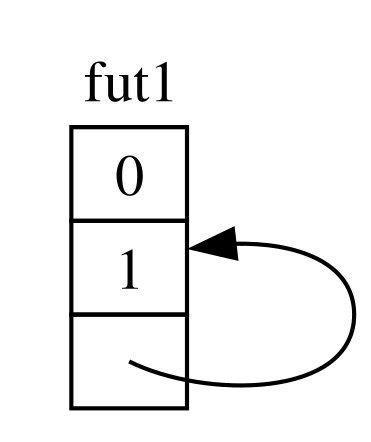

## Cái nhìn kỹ hơn về các Trait dành cho Async

<!-- Old headings. Do not remove or links may break. -->

<a id="digging-into-the-traits-for-async"></a>

Trong suốt chương này, chúng ta đã sử dụng các trait `Future`, `Pin`, `Unpin`, `Stream`, và
`StreamExt` theo nhiều cách khác nhau. Tuy nhiên, cho đến nay, chúng ta đã tránh đi sâu vào
chi tiết về cách chúng hoạt động hoặc cách chúng ăn khớp với nhau, điều này thường ổn
cho công việc Rust hàng ngày của bạn. Tuy nhiên, đôi khi bạn sẽ
gặp các tình huống mà bạn cần hiểu thêm một vài chi tiết trong số này.
Trong phần này, chúng ta sẽ tìm hiểu vừa đủ để giúp ích trong các kịch bản đó,
nhưng vẫn để dành những kiến thức _thực sự_ chuyên sâu cho các tài liệu khác.

<!-- Old headings. Do not remove or links may break. -->

<a id="future"></a>

### Trait `Future`

Hãy bắt đầu bằng cách xem xét kỹ hơn cách hoạt động của trait `Future`. Đây là cách
Rust định nghĩa nó:

```rust
use std::pin::Pin;
use std::task::{Context, Poll};

pub trait Future {
    type Output;

    fn poll(self: Pin<&mut Self>, cx: &mut Context<'_>) -> Poll<Self::Output>;
}
```

Định nghĩa trait đó bao gồm một loạt các kiểu dữ liệu mới và cũng có một số cú pháp mà chúng ta
chưa từng thấy trước đây, vì vậy hãy cùng tìm hiểu định nghĩa đó theo từng phần.

Đầu tiên, kiểu liên kết (associated type) `Output` của `Future` cho biết giá trị mà future đó sẽ phân giải thành.
Điều này tương tự như kiểu liên kết `Item` cho trait `Iterator`.
Thứ hai, `Future` cũng có phương thức `poll`, phương thức này nhận một tham chiếu `Pin`
đặc biệt cho tham số `self` của nó và một tham chiếu mutable đến kiểu `Context`,
và trả về một `Poll<Self::Output>`. Chúng ta sẽ nói thêm về `Pin` và
`Context` trong giây lát. Hiện tại, hãy tập trung vào những gì phương thức này trả về,
kiểu `Poll`:

```rust
enum Poll<T> {
    Ready(T),
    Pending,
}
```

Kiểu `Poll` này tương tự như `Option`. Nó có một biến thể mang giá trị,
`Ready(T)`, và một biến thể không có giá trị, `Pending`. Tuy nhiên, `Poll` mang một ý nghĩa khá
khác so với `Option`! Biến thể `Pending` cho biết rằng future
vẫn còn công việc phải làm, vì vậy người gọi sẽ cần kiểm tra lại sau. Biến thể `Ready`
cho biết rằng future đã hoàn thành công việc và giá trị `T` đã sẵn sàng.

> Ghi chú: Với hầu hết các futures, người gọi không nên gọi `poll` lại sau khi
> future đã trả về `Ready`. Nhiều futures sẽ gây lỗi panic nếu bị poll lại sau khi
> trở nên sẵn sàng. Các futures an toàn để poll lại sẽ nêu rõ điều đó trong
> tài liệu hướng dẫn của chúng. Điều này tương tự như hành vi của `Iterator::next`.

Khi bạn thấy mã sử dụng `await`, Rust sẽ biên dịch nó đằng sau hậu trường thành mã
gọi phương thức `poll`. Nếu bạn nhìn lại Liệt kê 17-4, nơi chúng ta in ra tiêu đề của trang
cho một URL duy nhất sau khi nó được phân giải, Rust biên dịch nó thành một thứ gì đó đại loại
như thế này (mặc dù không hoàn toàn giống hệt):

```rust,ignore
match page_title(url).poll() {
    Ready(page_title) => match page_title {
        Some(title) => println!("The title for {url} was {title}"),
        None => println!("{url} had no title"),
    }
    Pending => {
        // Nhưng điều gì sẽ xảy ra ở đây?
    }
}
```

Chúng ta nên làm gì khi future vẫn đang ở trạng thái `Pending`? Chúng ta cần một cách nào đó để thử
lại, và lại, và lại cho đến khi future cuối cùng đã sẵn sàng. Nói cách khác,
chúng ta cần một vòng lặp:

```rust,ignore
let mut page_title_fut = page_title(url);
loop {
    match page_title_fut.poll() {
        Ready(value) => match page_title {
            Some(title) => println!("The title for {url} was {title}"),
            None => println!("{url} had no title"),
        }
        Pending => {
            // tiếp tục (continue)
        }
    }
}
```

Tuy nhiên, nếu Rust biên dịch nó thành chính xác đoạn mã đó, thì mọi `await` sẽ
gây chặn (blocking)—hoàn toàn ngược lại với những gì chúng ta hướng tới! Thay vào đó, Rust đảm bảo
rằng vòng lặp có thể trao lại quyền kiểm soát cho một thứ gì đó có thể tạm dừng công việc trên
future này để làm việc trên các futures khác và sau đó kiểm tra lại future này sau. Như chúng ta đã
thấy, cái "thứ gì đó" đó là một môi trường thực thi (async runtime), và công việc lập lịch và điều phối này
là một trong những nhiệm vụ chính của nó.

Trước đó trong chương này, chúng ta đã mô tả việc chờ đợi trên `rx.recv`. Lệnh gọi `recv`
trả về một future, và việc await future đó sẽ thực hiện polling nó. Chúng ta đã lưu ý rằng một runtime sẽ
tạm dừng future cho đến khi nó sẵn sàng với `Some(message)` hoặc `None` khi
kênh đóng lại. Với sự hiểu biết sâu sắc hơn của chúng ta về trait `Future`, và
cụ thể là `Future::poll`, chúng ta có thể thấy cách điều đó hoạt động. Runtime biết
future chưa sẵn sàng khi nó trả về `Poll::Pending`. Ngược lại, runtime
biết future _đã_ sẵn sàng và tiến hành nó khi `poll` trả về
`Poll::Ready(Some(message))` hoặc `Poll::Ready(None)`.

Các chi tiết chính xác về cách một runtime thực hiện điều đó nằm ngoài phạm vi của cuốn sách này,
nhưng điểm mấu chốt là để thấy các cơ chế cơ bản của futures: một runtime _thăm dò_ (polls) mỗi
future mà nó chịu trách nhiệm, đưa future đó trở lại trạng thái ngủ khi nó chưa
sẵn sàng.

<!-- Old headings. Do not remove or links may break. -->

<a id="pinning-and-the-pin-and-unpin-traits"></a>

### Các trait `Pin` và `Unpin`

Khi chúng ta giới thiệu ý tưởng về việc ghim (pinning) trong Liệt kê 17-16, chúng ta đã gặp phải một thông báo
lỗi rất rắc rối. Đây là phần có liên quan của nó một lần nữa:

<!-- manual-regeneration
cd listings/ch17-async-await/listing-17-16
cargo build
copy *only* the final `error` block from the errors
-->

```text
error[E0277]: `{async block@src/main.rs:10:23: 10:33}` cannot be unpinned
  --> src/main.rs:48:33
   |
48 |         trpl::join_all(futures).await;
   |                                 ^^^^^ the trait `Unpin` is not implemented for `{async block@src/main.rs:10:23: 10:33}`
   |
   = note: consider using the `pin!` macro
           consider using `Box::pin` if you need to access the pinned value outside of the current scope
   = note: required for `Box<{async block@src/main.rs:10:23: 10:33}>` to implement `Future`
note: required by a bound in `futures_util::future::join_all::JoinAll`
  --> file:///home/.cargo/registry/src/index.crates.io-1949cf8c6b5b557f/futures-util-0.3.30/src/future/join_all.rs:29:8
   |
27 | pub struct JoinAll<F>
   |            ------- required by a bound in this struct
28 | where
29 |     F: Future,
   |        ^^^^^^ required by this bound in `JoinAll`
```

Thông báo lỗi này cho chúng ta biết không chỉ việc chúng ta cần ghim các giá trị mà còn giải thích tại sao
việc ghim là cần thiết. Hàm `trpl::join_all` trả về một struct có tên là
`JoinAll`. Struct đó là generic cho một kiểu `F`, kiểu này bị ràng buộc phải triển khai
trait `Future`. Việc trực tiếp await một future bằng `await` sẽ ghim
future đó một cách ngầm định. Đó là lý do tại sao chúng ta không cần sử dụng `pin!` ở mọi nơi chúng ta muốn
await các futures.

Tuy nhiên, chúng ta không trực tiếp await một future ở đây. Thay vào đó, chúng ta xây dựng một
future mới, `JoinAll`, bằng cách truyền một bộ sưu tập các futures cho hàm `join_all`.
Chữ ký của `join_all` yêu cầu các kiểu của các mục trong bộ sưu tập đều phải triển khai
trait `Future`, và `Box<T>` chỉ triển khai `Future` nếu kiểu `T` mà nó bao bọc
là một future có triển khai trait `Unpin`.

Đó là một khối lượng kiến thức lớn để hấp thụ! Để thực sự hiểu nó, hãy tìm hiểu sâu thêm một chút
về cách trait `Future` thực sự hoạt động, đặc biệt là xung quanh việc _ghim_ (pinning).

Hãy nhìn lại định nghĩa của trait `Future`:

```rust
use std::pin::Pin;
use std::task::{Context, Poll};

pub trait Future {
    type Output;

    // Required method
    fn poll(self: Pin<&mut Self>, cx: &mut Context<'_>) -> Poll<Self::Output>;
}
```

Tham số `cx` và kiểu `Context` của nó là chìa khóa để một runtime thực sự biết khi nào
cần kiểm tra bất kỳ future nào cho trước trong khi vẫn giữ tính lười biếng. Một lần nữa, các chi tiết
về cách hoạt động của nó nằm ngoài phạm vi của chương này, và bạn thường chỉ cần
nghĩ về điều này khi viết một bản triển khai `Future` tùy chỉnh. Chúng ta sẽ
tập trung thay vào đó vào kiểu dữ liệu cho `self`, vì đây là lần đầu tiên chúng ta thấy một
phương thức mà ở đó `self` có một chú thích kiểu (type annotation). Một chú thích kiểu cho `self` hoạt động
giống như chú thích kiểu cho các tham số hàm khác, nhưng có hai điểm khác biệt
chính:

- Nó cho Rust biết kiểu của `self` phải là gì để phương thức có thể được gọi.

- Nó không thể chỉ là bất kỳ kiểu nào. Nó bị giới hạn trong kiểu mà phương thức
  được triển khai trên đó, một tham chiếu hoặc smart pointer đến kiểu đó, hoặc một `Pin` bao bọc một
  tham chiếu đến kiểu đó.

Chúng ta sẽ thấy nhiều hơn về cú pháp này trong [Chương 18][ch-18]<!-- ignore -->. Hiện tại,
chỉ cần biết rằng nếu chúng ta muốn poll một future để kiểm tra xem nó đang ở trạng thái
`Pending` hay `Ready(Output)`, chúng ta cần một tham chiếu mutable được bao bọc bởi `Pin` đến
kiểu đó.

`Pin` là một trình bao bọc (wrapper) cho các kiểu giống như con trỏ (pointer-like types) như `&`, `&mut`, `Box`, và `Rc`.
(Về mặt kỹ thuật, `Pin` hoạt động với các kiểu triển khai trait `Deref` hoặc `DerefMut`,
nhưng điều này thực tế tương đương với việc chỉ làm việc với các con trỏ.) `Pin`
bản thân nó không phải là một con trỏ và không có bất kỳ hành vi riêng nào như `Rc` và
`Arc` làm với đếm tham chiếu (reference counting); nó hoàn thuần là một công cụ mà trình biên dịch có thể sử dụng để
thực thi các ràng buộc đối với việc sử dụng con trỏ.

Việc nhớ lại rằng `await` được triển khai dựa trên các lời gọi đến `poll` bắt đầu
giải thích thông báo lỗi mà chúng ta đã thấy trước đó, nhưng thông báo đó liên quan đến `Unpin`, chứ không
phải `Pin`. Vậy chính xác thì `Pin` liên quan gì đến `Unpin`, và tại sao `Future` cần
`self` phải ở trong kiểu `Pin` để gọi `poll`?

Hãy nhớ lại từ phần trước trong chương này, một chuỗi các await points trong một future được
biên dịch thành một máy trạng thái (state machine), và trình biên dịch đảm bảo máy trạng thái đó
tuân thủ tất cả các quy tắc bình thường của Rust về an toàn, bao gồm việc vay mượn và
sở hữu. Để làm cho điều đó hoạt động, Rust xem xét dữ liệu nào là cần thiết giữa một
await point và await point tiếp theo hoặc điểm kết thúc của khối async. Sau đó nó
tạo ra một biến thể tương ứng trong máy trạng thái đã biên dịch. Mỗi biến thể
nhận được quyền truy cập cần thiết vào dữ liệu sẽ được sử dụng trong phần đó của
mã nguồn, cho dù bằng cách lấy quyền sở hữu dữ liệu đó hoặc bằng cách nhận một tham chiếu mutable hoặc
không mutable đến nó.

Cho đến nay mọi việc vẫn ổn: nếu chúng ta làm sai bất cứ điều gì về quyền sở hữu hoặc tham chiếu trong một
khối async nhất định, borrow checker sẽ báo cho chúng ta biết. Khi chúng ta muốn di chuyển
future tương ứng với khối đó—như di chuyển nó vào một `Vec` để truyền cho
`join_all`—mọi thứ trở nên khó khăn hơn.

Khi chúng ta di chuyển một future—cho dù bằng cách đẩy nó vào một cấu trúc dữ liệu để sử dụng như một
iterator với `join_all` hoặc bằng cách trả về nó từ một hàm—điều đó thực sự có nghĩa là
di chuyển máy trạng thái mà Rust tạo ra cho chúng ta. Và không giống như hầu hết các kiểu dữ liệu khác trong
Rust, các futures mà Rust tạo ra cho các khối async có thể kết thúc bằng các tham chiếu đến
chính chúng trong các trường của bất kỳ biến thể nào cho trước, như được hiển thị trong hình minh họa đơn giản hóa ở Hình 17-4.

<figure>



<figcaption>Hình 17-4: Một kiểu dữ liệu tự tham chiếu.</figcaption>

</figure>

Tuy nhiên, theo mặc định, bất kỳ đối tượng nào có tham chiếu đến chính nó đều không an toàn để di chuyển,
bởi vì các tham chiếu luôn trỏ đến địa chỉ bộ nhớ thực tế của bất kỳ thứ gì mà chúng tham chiếu đến
(xem Hình 17-5). Nếu bạn di chuyển chính cấu trúc dữ liệu đó, các tham chiếu nội bộ
đó sẽ bị bỏ lại trỏ đến vị trí cũ. Tuy nhiên, vị trí bộ nhớ đó hiện không còn hợp lệ.
Một mặt, giá trị của nó sẽ không được cập nhật khi bạn thực hiện các thay đổi đối với cấu trúc dữ liệu.
Mặt khác—quan trọng hơn—máy tính bây giờ có thể tự do tái sử dụng bộ nhớ đó cho các mục đích khác! Bạn có thể
kết thúc bằng việc đọc các dữ liệu hoàn toàn không liên quan sau đó.

<figure>


<figcaption>Hình 17-5: Kết quả không an toàn của việc di chuyển một kiểu dữ liệu tự tham chiếu</figcaption>

</figure>

Về mặt lý thuyết, trình biên dịch Rust có thể cố gắng cập nhật mọi tham chiếu đến một
đối tượng bất cứ khi nào nó được di chuyển, nhưng điều đó có thể làm tăng nhiều chi phí hiệu suất,
đặc biệt nếu toàn bộ một mạng lưới các tham chiếu cần cập nhật. Thay vào đó, nếu chúng ta có thể
đảm bảo cấu trúc dữ liệu đang xét _không di chuyển trong bộ nhớ_, chúng ta sẽ không
phải cập nhật bất kỳ tham chiếu nào. Đây chính xác là những gì borrow checker của Rust yêu cầu:
trong mã an toàn, nó ngăn bạn di chuyển bất kỳ mục nào đang có một tham chiếu hoạt động đến
nó.

`Pin` xây dựng dựa trên điều đó để cung cấp cho chúng ta sự đảm bảo chính xác mà chúng ta cần. Khi chúng ta _ghim_ (pin) một
giá trị bằng cách bao bọc một con trỏ đến giá trị đó trong `Pin`, nó không còn có thể di chuyển nữa. Do đó,
nếu bạn có `Pin<Box<SomeType>>`, bạn thực sự ghim giá trị `SomeType`, _chứ không phải_
con trỏ `Box`. Hình 17-6 minh họa quá trình này.

<figure>


<figcaption>Hình 17-6: Ghim một `Box` trỏ đến một kiểu future tự tham chiếu.</figcaption>

</figure>

Trên thực tế, con trỏ `Box` vẫn có thể di chuyển xung quanh một cách tự do. Hãy nhớ rằng: chúng ta quan tâm đến việc
đảm bảo dữ liệu cuối cùng đang được tham chiếu vẫn giữ nguyên vị trí. Nếu một con trỏ
di chuyển xung quanh, _nhưng dữ liệu nó trỏ đến vẫn ở cùng một chỗ_, như trong Hình
17-7, thì không có vấn đề tiềm ẩn nào cả. (Như một bài tập độc lập, hãy xem tài liệu hướng dẫn
cho các kiểu dữ liệu cũng như mô-đun `std::pin` và cố gắng tìm hiểu cách bạn sẽ làm
điều này với một `Pin` bao bọc một `Box`.) Điểm mấu chốt là chính kiểu tự tham chiếu
không thể di chuyển, bởi vì nó vẫn được ghim.

<figure>


<figcaption>Hình 17-7: Di chuyển một `Box` trỏ đến một kiểu future tự tham chiếu.</figcaption>

</figure>

Tuy nhiên, hầu hết các kiểu dữ liệu đều hoàn toàn an toàn để di chuyển xung quanh, ngay cả khi chúng tình cờ
nằm đằng sau một trình bao bọc `Pin`. Chúng ta chỉ cần nghĩ về việc ghim khi các mục có
các tham chiếu nội bộ. Các giá trị nguyên thủy như số và Booleans là an toàn
bởi vì rõ ràng chúng không có bất kỳ tham chiếu nội bộ nào. Hầu hết các kiểu dữ liệu
bạn thường làm việc với trong Rust cũng vậy. Bạn có thể di chuyển một `Vec`, ví dụ,
mà không cần lo lắng. Chỉ dựa trên những gì chúng ta đã thấy cho đến nay, nếu bạn có một
`Pin<Vec<String>>`, bạn sẽ phải làm mọi thứ thông qua các API an toàn nhưng bị hạn chế
được cung cấp bởi `Pin`, mặc dù một `Vec<String>` luôn an toàn để di chuyển nếu
không có các tham chiếu khác đến nó. Chúng ta cần một cách để nói với trình biên dịch rằng
việc di chuyển các mục xung quanh trong những trường hợp như thế này là ổn—và đó là lúc `Unpin` tham gia.

`Unpin` là một trait đánh dấu (marker trait), tương tự như các trait `Send` và `Sync` chúng ta đã thấy trong
Chương 16, và do đó không có chức năng riêng. Các traits đánh dấu tồn tại chỉ để
nói cho trình biên dịch biết rằng việc sử dụng kiểu triển khai một trait nhất định trong một ngữ cảnh cụ thể là an toàn.
`Unpin` thông báo cho trình biên dịch rằng một kiểu dữ liệu nhất định _không_
cần phải giữ bất kỳ sự đảm bảo nào về việc liệu giá trị đang xét có thể được di chuyển một cách an toàn hay không.

<!--
  The inline `<code>` in the next block is to allow the inline `<em>` inside it,
  matching what NoStarch does style-wise, and emphasizing within the text here
  that it is something distinct from a normal type.
-->

Giống như với `Send` và `Sync`, trình biên dịch tự động triển khai `Unpin`
cho tất cả các kiểu dữ liệu mà nó có thể chứng minh là an toàn. Một trường hợp đặc biệt, một lần nữa tương tự như
`Send` và `Sync`, là nơi `Unpin` _không_ được triển khai cho một kiểu. Cách viết cho điều này là
<code>impl !Unpin for <em>SomeType</em></code>, trong đó
<code><em>SomeType</em></code> là tên của một kiểu dữ liệu _thực sự_ cần phải tuân thủ
những sự đảm bảo đó để được an toàn bất cứ khi nào một con trỏ tới kiểu đó được sử dụng trong một `Pin`.

Nói cách khác, có hai điều cần lưu ý về mối quan hệ
giữa `Pin` và `Unpin`. Đầu tiên, `Unpin` là trường hợp “bình thường”, và `!Unpin` là
trường hợp đặc biệt. Thứ hai, liệu một kiểu triển khai `Unpin` hay `!Unpin` _chỉ_
quan trọng khi bạn đang sử dụng một con trỏ được ghim (pinned pointer) cho kiểu đó như <code>Pin<&mut
<em>SomeType</em>></code>.

Để làm cho điều đó cụ thể, hãy nghĩ về một `String`: nó có một độ dài và các ký tự Unicode
tạo nên nó. Chúng ta có thể bao bọc một `String` trong `Pin`, như thấy ở Hình 17-8. Tuy nhiên,
`String` tự động triển khai `Unpin`, giống như hầu hết các kiểu dữ liệu khác
trong Rust.

<figure>


<figcaption>Hình 17-8: Ghim một `String`; đường đứt nét cho biết rằng `String` triển khai trait `Unpin`, và do đó không bị ghim.</figcaption>

</figure>

Kết quả là, chúng ta có thể làm những việc lẽ ra sẽ không hợp lệ nếu `String` triển khai
`!Unpin` thay thế, chẳng hạn như thay thế một chuỗi này bằng một chuỗi khác tại chính
vị trí đó trong bộ nhớ như ở Hình 17-9. Điều này không vi phạm hợp đồng `Pin`,
bởi vì `String` không có tham chiếu nội bộ nào khiến nó không an toàn khi di chuyển xung quanh!
Đó chính xác là lý do tại sao nó triển khai `Unpin` thay vì `!Unpin`.

<figure>


<figcaption>Hình 17-9: Thay thế `String` bằng một `String` hoàn toàn khác trong bộ nhớ.</figcaption>

</figure>

Bây giờ chúng ta đã biết đủ để hiểu các lỗi được báo cáo cho lời gọi `join_all`
từ Liệt kê 17-17. Ban đầu chúng ta đã cố gắng di chuyển các futures được tạo ra bởi
các khối async vào một `Vec<Box<dyn Future<Output = ()>>>`, nhưng như chúng ta đã thấy,
những futures đó có thể có các tham chiếu nội bộ, vì vậy chúng không triển khai `Unpin`.
Chúng cần được ghim, và sau đó chúng ta có thể truyền kiểu `Pin` vào `Vec`,
tự tin rằng dữ liệu cơ bản trong các futures sẽ _không_ bị di chuyển.

`Pin` và `Unpin` chủ yếu quan trọng đối với việc xây dựng các thư viện cấp thấp hơn, hoặc
khi bạn đang tự xây dựng một runtime, thay vì cho mã Rust hàng ngày.
Tuy nhiên, khi bạn thấy các trait này trong thông báo lỗi, bây giờ bạn sẽ có một
ý tưởng tốt hơn về cách sửa mã của mình!

> Ghi chú: Sự kết hợp của `Pin` và `Unpin` giúp chúng ta có thể triển khai một cách an toàn
> cả một lớp các kiểu phức tạp trong Rust mà nếu không sẽ chứng minh là rất
> thách thức vì chúng tự tham chiếu. Các kiểu yêu cầu `Pin` xuất hiện
> phổ biến nhất trong async Rust ngày nay, nhưng thỉnh thoảng, bạn có thể
> thấy chúng trong các ngữ cảnh khác nữa.
>
> Các chi tiết cụ thể về cách hoạt động của `Pin` và `Unpin`, và các quy tắc mà chúng bắt buộc
> phải tuân thủ, được trình bày sâu rộng trong tài liệu API cho `std::pin`, vì vậy
> nếu bạn quan tâm đến việc tìm hiểu thêm, đó là một nơi tuyệt vời để bắt đầu.
>
> Nếu bạn muốn hiểu mọi thứ hoạt động bên dưới như thế nào với nhiều chi tiết hơn nữa,
> hãy xem Chương [2][under-the-hood] và [4][pinning] của cuốn [_Asynchronous
> Programming in Rust_][async-book].

### Trait `Stream`

Bây giờ bạn đã nắm bắt sâu hơn về các trait `Future`, `Pin`, và `Unpin`, chúng ta
có thể hướng sự chú ý của mình sang trait `Stream`. Như bạn đã học ở phần trước trong
chương này, streams tương tự như các iterators bất đồng bộ. Tuy nhiên, không giống như `Iterator` và
`Future`, `Stream` không có định nghĩa trong thư viện tiêu chuẩn tính đến thời điểm viết
bài này, nhưng có _một_ định nghĩa rất phổ biến từ crate `futures` được sử dụng
xuyên suốt hệ sinh thái.

Hãy xem lại các định nghĩa của các trait `Iterator` và `Future` trước khi
xem xét cách một trait `Stream` có thể hợp nhất chúng lại với nhau. Từ `Iterator`, chúng ta
có ý tưởng về một chuỗi: phương thức `next` của nó cung cấp một `Option<Self::Item>`.
Từ `Future`, chúng ta có ý tưởng về sự sẵn sàng theo thời gian: phương thức `poll` của nó
cung cấp một `Poll<Self::Output>`. Để biểu diễn một chuỗi các mục trở nên
sẵn sàng theo thời gian, chúng ta định nghĩa một trait `Stream` kết hợp những đặc điểm đó lại với nhau:

```rust
use std::pin::Pin;
use std::task::{Context, Poll};

trait Stream {
    type Item;

    fn poll_next(
        self: Pin<&mut Self>,
        cx: &mut Context<'_>
    ) -> Poll<Option<Self::Item>>;
}
```

Trait `Stream` định nghĩa một kiểu liên kết có tên là `Item` cho kiểu của các
mục được tạo ra bởi stream. Điều này tương tự như `Iterator`, nơi có thể có
từ không đến nhiều mục, và không giống như `Future`, nơi luôn có một
`Output` duy nhất, ngay cả khi đó là kiểu unit `()`.

`Stream` cũng định nghĩa một phương thức để lấy các mục đó. Chúng ta gọi nó là `poll_next`, để
làm rõ rằng nó thăm dò (polls) theo cùng một cách `Future::poll` làm và tạo ra một
chuỗi các mục theo cùng một cách `Iterator::next` làm. Kiểu trả về của nó
kết hợp `Poll` với `Option`. Kiểu bên ngoài là `Poll`, bởi vì nó phải được
kiểm tra sự sẵn sàng, giống như một future làm. Kiểu bên trong là `Option`,
bởi vì nó cần phát tín hiệu liệu có còn tin nhắn hay không, giống như một iterator
làm.

Một thứ gì đó rất giống với định nghĩa này có khả năng sẽ kết thúc bằng việc trở thành một phần của thư viện
tiêu chuẩn của Rust. Trong khi chờ đợi, nó là một phần của bộ công cụ của hầu hết các runtimes, vì vậy
bạn có thể tin cậy vào nó, và mọi thứ chúng ta đề cập tiếp theo nhìn chung sẽ được áp dụng!

Tuy nhiên, trong ví dụ chúng ta đã thấy trong phần về streaming, chúng ta đã không sử dụng
`poll_next` _hay_ `Stream`, mà thay vào đó đã sử dụng `next` và `StreamExt`. Tất nhiên, chúng ta _có thể_
làm việc trực tiếp theo các thuật ngữ của API `poll_next` bằng cách tự viết các
máy trạng thái `Stream` của riêng mình, giống như cách chúng ta _có thể_ làm việc trực tiếp với các futures thông qua
phương thức `poll` của chúng. Tuy nhiên, việc sử dụng `await` thì đẹp hơn nhiều, và trait `StreamExt`
cung cấp phương thức `next` để chúng ta có thể làm điều đó:

```rust
{{#rustdoc_include ../listings/ch17-async-await/no-listing-stream-ext/src/lib.rs:here}}
```

<!--
TODO: update this if/when tokio/etc. update their MSRV and switch to using async functions
in traits, since the lack thereof is the reason they do not yet have this.
-->

> Ghi chú: Định nghĩa thực tế chúng ta đã sử dụng ở phần trước trong chương này trông hơi
> khác so với cái này, bởi vì nó hỗ trợ các phiên bản Rust vốn chưa
> hỗ trợ việc sử dụng hàm async trong traits. Kết quả là, nó trông như thế này:
>
> ```rust,ignore
> fn next(&mut self) -> Next<'_, Self> where Self: Unpin;
> ```
>
> Kiểu `Next` đó là một `struct` triển khai `Future` và cho phép chúng ta đặt tên cho
> thời gian sống của tham chiếu đến `self` với `Next<'_, Self>`, để `await`
> có thể làm việc với phương thức này.

Trait `StreamExt` cũng là ngôi nhà của tất cả các phương thức thú vị sẵn có
để sử dụng với streams. `StreamExt` được tự động triển khai cho mọi kiểu dữ liệu
có triển khai `Stream`, nhưng các traits này được định nghĩa riêng biệt để cho phép
cộng đồng lặp lại các API tiện lợi mà không ảnh hưởng đến trait
nền tảng.

Trong phiên bản `StreamExt` được sử dụng trong crate `trpl`, trait này không chỉ
định nghĩa phương thức `next` mà còn cung cấp một bản triển khai mặc định của `next`
giúp xử lý chính xác các chi tiết của việc gọi `Stream::poll_next`. Điều này có nghĩa
là ngay cả khi bạn cần viết kiểu dữ liệu truyền trực tuyến (streaming data type) của riêng mình, bạn _chỉ_
cần triển khai `Stream`, và sau đó bất kỳ ai sử dụng kiểu dữ liệu của bạn đều có thể sử dụng
`StreamExt` và các phương thức của nó một cách tự động.

Đó là tất cả những gì chúng ta sẽ đề cập cho các chi tiết cấp thấp hơn về các trait này. Để
tổng kết, hãy cùng xem xét các futures (bao gồm cả streams), tasks, và threads tất cả
ăn khớp với nhau như thế nào!

{{#quiz ../quizzes/async-05-traits-for-async.toml}}

[ch-18]: ch18-00-oop.html
[async-book]: https://rust-lang.github.io/async-book/
[under-the-hood]: https://rust-lang.github.io/async-book/02_execution/01_chapter.html
[pinning]: https://rust-lang.github.io/async-book/04_pinning/01_chapter.html
[first-async]: ch17-01-futures-and-syntax.html#our-first-async-program
[any-number-futures]: ch17-03-more-futures.html#working-with-any-number-of-futures
