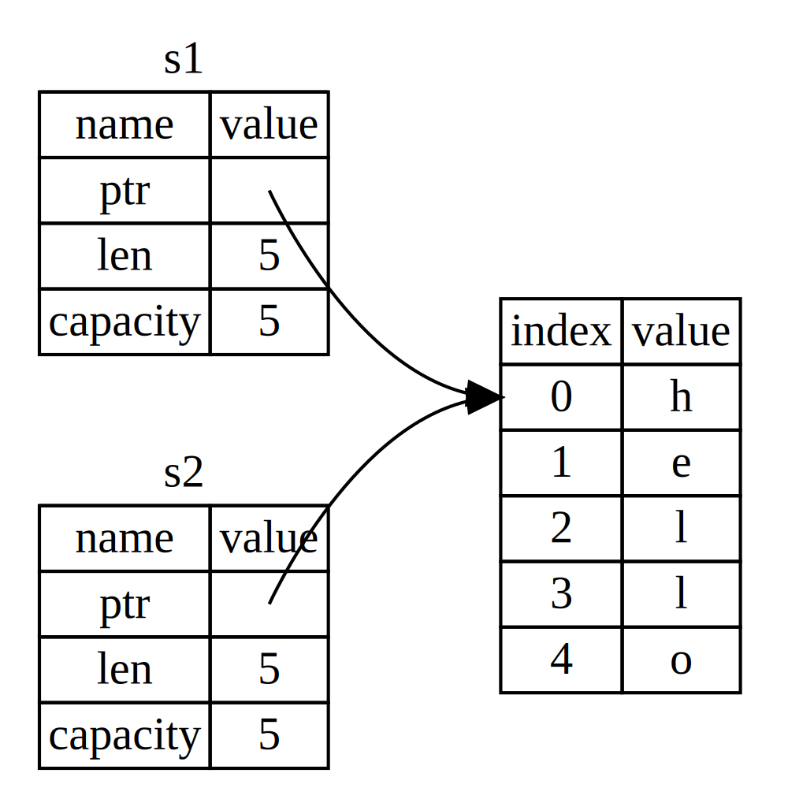

## What Is Ownership?

_Ownership_ (_Quyền sở hữu_) là tập hợp các quy tắc điều chỉnh cách một chương trình Rust quản lý bộ nhớ.
Mọi chương trình đều phải quản lý cách sử dụng bộ nhớ của máy tính trong khi chạy.
Một số ngôn ngữ có bộ gom rác (garbage collection) thường xuyên tìm và dọn dẹp vùng nhớ không còn được dùng khi chương trình đang chạy; ở các ngôn ngữ khác, lập trình viên phải tự mình cấp phát và giải phóng bộ nhớ.
Rust dùng cách tiếp cận thứ ba: bộ nhớ được quản lý thông qua hệ thống quyền sở hữu với một tập quy tắc được trình biên dịch kiểm tra.
Nếu bất kỳ quy tắc nào bị vi phạm, chương trình sẽ không biên dịch được.
Không có tính năng nào của quyền sở hữu làm chậm chương trình của bạn khi nó đang chạy.

Vì quyền sở hữu là một khái niệm mới với nhiều lập trình viên, nên sẽ mất thời gian để làm quen.
Tin vui là khi bạn càng có kinh nghiệm với Rust và các quy tắc của hệ thống quyền sở hữu, bạn sẽ càng thấy dễ dàng hơn để viết ra mã an toàn và hiệu quả một cách tự nhiên.
Cứ kiên trì nhé!

Khi bạn hiểu quyền sở hữu, bạn sẽ có nền tảng vững chắc để hiểu các tính năng làm Rust trở nên khác biệt.
Trong chương này, bạn sẽ học quyền sở hữu bằng cách đi qua một số ví dụ tập trung vào một cấu trúc dữ liệu rất phổ biến: chuỗi (string).

> ### Stack và Heap
>
> Nhiều ngôn ngữ lập trình không đòi hỏi bạn phải nghĩ nhiều về stack và heap.
> Nhưng trong một ngôn ngữ lập trình hệ thống như Rust, việc một giá trị nằm trên stack hay heap sẽ ảnh hưởng đến cách ngôn ngữ hành xử và lý do vì sao bạn phải đưa ra một số quyết định nhất định.
> Một phần quyền sở hữu sẽ được mô tả liên hệ với stack và heap ở phần sau của chương này, nên đây là phần giải thích ngắn để chuẩn bị.
>
> Cả stack và heap đều là các vùng bộ nhớ mà mã của bạn có thể sử dụng lúc runtime, nhưng chúng được tổ chức theo những cách khác nhau.
> Stack lưu trữ các giá trị theo thứ tự nó nhận và loại bỏ chúng theo thứ tự ngược lại.
> Điều này được gọi là _vào sau, ra trước_.
> Hãy nghĩ về một chồng đĩa: khi bạn thêm đĩa, bạn đặt chúng lên trên cùng của chồng, và khi cần một cái đĩa, bạn lấy cái ở trên cùng.
> Thêm hoặc bớt đĩa ở giữa hay dưới đáy sẽ không hiệu quả!
> Thêm dữ liệu được gọi là _đẩy lên stack_, và loại bỏ dữ liệu được gọi là _lấy khỏi stack_.
> Tất cả dữ liệu lưu trên stack phải có kích thước đã biết và cố định.
> Dữ liệu có kích thước không biết tại thời điểm biên dịch hoặc có thể thay đổi phải được lưu trên heap.
>
> Heap thì ít có tổ chức hơn: khi bạn đặt dữ liệu lên heap, bạn yêu cầu một lượng không gian nhất định.
> Bộ cấp phát bộ nhớ sẽ tìm một chỗ trống trên heap đủ lớn, đánh dấu nó là đang sử dụng, và trả về một _con trỏ_, tức địa chỉ của vị trí đó.
> Quá trình này gọi là _cấp phát trên heap_ và đôi khi được viết ngắn gọn là _cấp phát_ (đẩy giá trị lên stack không được xem là cấp phát).
> Vì con trỏ trỏ tới heap có kích thước đã biết và cố định, bạn có thể lưu con trỏ trên stack, nhưng khi cần dữ liệu thực, bạn phải theo con trỏ.
> Hãy nghĩ đến việc vào nhà hàng.
> Khi vào, bạn nói số người trong nhóm, và nhân viên sắp chỗ tìm một bàn trống phù hợp rồi dẫn bạn đến.
> Nếu có ai trong nhóm đến trễ, họ có thể hỏi bạn được ngồi ở đâu để tìm đến.
>
> Đẩy lên stack nhanh hơn cấp phát trên heap vì bộ cấp phát không cần tìm chỗ để lưu dữ liệu mới; vị trí đó luôn nằm trên đỉnh stack.
> So sánh với việc đó, cấp phát không gian trên heap tốn nhiều công hơn vì bộ cấp phát phải tìm một chỗ đủ lớn để chứa dữ liệu rồi thực hiện các bước ghi sổ để chuẩn bị cho lần cấp phát tiếp theo.
>
> Truy cập dữ liệu trên heap thường chậm hơn truy cập dữ liệu trên stack vì bạn phải theo một con trỏ để đến đó.
> Bộ xử lý hiện đại hoạt động nhanh hơn nếu nó phải nhảy quanh trong bộ nhớ ít hơn.
> Tiếp tục ẩn dụ, hãy tưởng tượng một phục vụ đang ghi gọi món từ nhiều bàn.
> Hiệu quả nhất là lấy tất cả món từ một bàn trước khi chuyển sang bàn tiếp theo.
> Lấy một món từ bàn A, rồi một món từ bàn B, rồi lại quay về A, rồi lại B sẽ chậm hơn nhiều.
> Tương tự, bộ xử lý thường làm việc tốt hơn nếu nó xử lý dữ liệu nằm gần nhau (như trên stack) hơn là xa nhau (như trên heap).
>
> Khi mã của bạn gọi một hàm, các giá trị được truyền vào hàm (bao gồm, có thể, các con trỏ trỏ đến dữ liệu trên heap) và các biến cục bộ của hàm sẽ được đẩy lên stack.
> Khi hàm kết thúc, các giá trị đó được lấy khỏi stack.
>
> Theo dõi phần nào của mã đang dùng dữ liệu nào trên heap, giảm thiểu lượng dữ liệu trùng lặp trên heap, và dọn dẹp dữ liệu không dùng nữa trên heap để bạn không bị hết chỗ — tất cả đều là các vấn đề mà quyền sở hữu giải quyết.
> Khi bạn hiểu quyền sở hữu, bạn sẽ không cần nghĩ nhiều về stack và heap nữa, nhưng biết rằng mục đích chính của quyền sở hữu là quản lý dữ liệu trên heap sẽ giúp giải thích tại sao nó hoạt động như vậy.

### Các quy tắc về quyền sở hữu

Đầu tiên, hãy xem các quy tắc về quyền sở hữu.
Hãy ghi nhớ các quy tắc này khi chúng ta làm việc qua các ví dụ minh họa chúng:

- Mỗi giá trị trong Rust có một _chủ sở hữu_.
- Tại một thời điểm chỉ có thể có một chủ sở hữu.
- Khi chủ sở hữu ra khỏi phạm vi, giá trị sẽ bị hủy (dropped).

### Phạm vi của biến

Bây giờ chúng ta đã qua phần cú pháp Rust cơ bản, chúng ta sẽ không đưa tất cả mã `fn main() {` vào ví dụ nữa, nên nếu bạn làm theo, hãy chắc chắn đặt các ví dụ sau vào trong một hàm `main` thủ công.
Nhờ đó, ví dụ của chúng ta sẽ gọn hơn một chút, cho phép tập trung vào chi tiết thay vì mã khuôn mẫu.

Là ví dụ đầu tiên về quyền sở hữu, chúng ta sẽ nhìn vào _phạm vi_ của một số biến.
Phạm vi là vùng trong chương trình mà một thực thể còn hiệu lực.
Xem biến sau:

```rust
let s = "hello";
```

Biến `s` tham chiếu tới một chuỗi literal, nơi giá trị của chuỗi được ghi cứng vào văn bản của chương trình.
Biến này hợp lệ từ thời điểm nó được khai báo cho đến cuối _phạm vi_ hiện tại.
Listing 4-1 cho thấy một chương trình với các chú thích đánh dấu nơi biến `s` còn hiệu lực.

<Listing number="4-1" caption="Một biến và phạm vi mà nó còn hiệu lực">

```rust
{{#rustdoc_include ../listings/ch04-understanding-ownership/listing-04-01/src/main.rs:here}}
```

</Listing>

Nói cách khác, có hai thời điểm quan trọng ở đây:

- Khi `s` _đi vào_ phạm vi, nó hợp lệ.
- Nó vẫn hợp lệ cho đến khi _ra khỏi_ phạm vi.

Ở thời điểm này, mối quan hệ giữa phạm vi và thời điểm biến còn hợp lệ tương tự như các ngôn ngữ lập trình khác.
Giờ chúng ta sẽ xây dựng thêm hiểu biết này bằng cách giới thiệu kiểu `String`.

### Kiểu `String`

Để minh họa các quy tắc về quyền sở hữu, chúng ta cần một kiểu dữ liệu phức tạp hơn những gì đã nói ở mục [“Kiểu dữ liệu”][data-types]<!-- ignore --> của Chương 3.
Các kiểu đã đề cập trước đó có kích thước đã biết, có thể lưu trên stack và được lấy khỏi stack khi phạm vi của chúng kết thúc, và có thể được sao chép nhanh chóng, đơn giản để tạo ra một thể hiện mới, độc lập nếu một phần khác của mã cần dùng cùng giá trị ở phạm vi khác.
Nhưng chúng ta muốn nhìn vào dữ liệu được lưu trên heap và khám phá cách Rust biết khi nào cần dọn dẹp dữ liệu đó, và kiểu `String` là ví dụ tuyệt vời.

Chúng ta sẽ tập trung vào những phần của `String` liên quan đến quyền sở hữu.
Những khía cạnh này cũng áp dụng cho các kiểu dữ liệu phức tạp khác, dù do thư viện chuẩn cung cấp hay do bạn tạo.
Chúng ta sẽ bàn sâu về `String` ở [Chương 8][ch8]<!-- ignore -->.

Chúng ta đã thấy các chuỗi literal, nơi một giá trị chuỗi được ghi cứng vào chương trình.
Chuỗi literal tiện lợi, nhưng không phù hợp cho mọi tình huống cần dùng văn bản.
Một lý do là chúng bất biến.
Một lý do khác là không phải lúc nào giá trị chuỗi cũng đã biết khi ta viết mã: ví dụ, nếu ta muốn nhận input từ người dùng và lưu lại thì sao?
Cho các tình huống đó, Rust có một kiểu chuỗi thứ hai, `String`.
Kiểu này quản lý dữ liệu được cấp phát trên heap và nhờ đó có thể lưu một lượng văn bản không biết trước tại thời điểm biên dịch.
Bạn có thể tạo `String` từ chuỗi literal bằng hàm `from`, như sau:

```rust
let s = String::from("hello");
```

Toán tử hai dấu hai chấm `::` cho phép chúng ta đặt tên không gian cho hàm `from` cụ thể này dưới kiểu `String` thay vì dùng một cái tên như `string_from`.
Chúng ta sẽ bàn thêm về cú pháp này ở phần [“Cú pháp phương thức”][method-syntax]<!-- ignore --> của Chương 5, và khi nói về phân cấp tên với mô-đun trong [“Đường dẫn để tham chiếu tới một mục trong cây mô-đun”][paths-module-tree]<!-- ignore --> ở Chương 7.

Kiểu chuỗi này _có thể_ được thay đổi:

```rust
{{#rustdoc_include ../listings/ch04-understanding-ownership/no-listing-01-can-mutate-string/src/main.rs:here}}
```

Vậy sự khác biệt ở đây là gì?
Tại sao `String` có thể thay đổi còn literal thì không?
Sự khác biệt nằm ở cách hai kiểu này xử lý bộ nhớ.

### Bộ nhớ và cấp phát

Với chuỗi literal, chúng ta biết nội dung tại thời điểm biên dịch, nên văn bản được ghi cứng trực tiếp vào file thực thi cuối cùng.
Đó là lý do chuỗi literal nhanh và hiệu quả.
Nhưng những đặc tính này chỉ có được nhờ tính bất biến của chuỗi literal.
Đáng tiếc, chúng ta không thể đưa một khối bộ nhớ vào file nhị phân cho mỗi đoạn văn bản có kích thước không biết trước khi biên dịch và có thể thay đổi khi chương trình chạy.

Với kiểu `String`, để hỗ trợ một đoạn văn bản có thể thay đổi và mở rộng, chúng ta cần cấp phát một lượng bộ nhớ trên heap, không biết trước tại thời điểm biên dịch, để chứa nội dung.
Điều này có nghĩa là:

- Bộ nhớ phải được yêu cầu từ bộ cấp phát bộ nhớ khi runtime.
- Chúng ta cần cách trả lại vùng nhớ này cho bộ cấp phát khi không dùng `String` nữa.

Phần đầu tiên do chúng ta làm: khi gọi `String::from`, hiện thực của nó sẽ yêu cầu lượng bộ nhớ cần thiết.
Điều này gần như là phổ biến trong các ngôn ngữ lập trình.

Tuy nhiên, phần thứ hai thì khác.
Trong các ngôn ngữ có _bộ gom rác (GC)_, GC theo dõi và dọn dẹp bộ nhớ không còn được dùng nữa, và chúng ta không phải nghĩ về nó.
Trong hầu hết các ngôn ngữ không có GC, trách nhiệm của chúng ta là xác định khi nào bộ nhớ không còn được dùng và gọi mã để giải phóng nó, giống như khi ta yêu cầu nó.
Làm đúng điều này từ trước đến nay là một bài toán lập trình khó.
Nếu quên, chúng ta sẽ lãng phí bộ nhớ.
Nếu làm quá sớm, chúng ta sẽ có biến không hợp lệ.
Nếu làm hai lần, đó cũng là một lỗi.
Chúng ta cần ghép chính xác một lần `allocate` với một lần `free`.

Rust đi con đường khác: bộ nhớ được tự động trả lại khi biến sở hữu nó ra khỏi phạm vi.
Đây là phiên bản ví dụ về phạm vi trước đó (Listing 4-1) nhưng dùng `String` thay vì chuỗi literal:

```rust
{{#rustdoc_include ../listings/ch04-understanding-ownership/no-listing-02-string-scope/src/main.rs:here}}
```

Có một thời điểm tự nhiên mà ta có thể trả lại bộ nhớ mà `String` của chúng ta cần cho bộ cấp phát: khi `s` ra khỏi phạm vi.
Khi một biến ra khỏi phạm vi, Rust gọi một hàm đặc biệt cho chúng ta.
Hàm này gọi là [`drop`][drop]<!-- ignore -->, và đó là nơi tác giả của `String` đặt mã để trả lại bộ nhớ.
Rust tự động gọi `drop` tại dấu ngoặc nhọn đóng.

> Lưu ý: Trong C++, mẫu giải phóng tài nguyên ở cuối vòng đời của một thực thể đôi khi được gọi là _Resource Acquisition Is Initialization (RAII)_.
> Hàm `drop` trong Rust sẽ quen thuộc với bạn nếu bạn từng dùng mẫu RAII.

Mẫu này có ảnh hưởng sâu sắc đến cách viết mã Rust.
Hiện tại có thể thấy đơn giản, nhưng hành vi của mã có thể gây bất ngờ trong các tình huống phức tạp hơn khi chúng ta muốn nhiều biến cùng dùng dữ liệu đã được cấp phát trên heap.
Hãy khám phá một vài tình huống như thế ngay bây giờ.

<!-- Old heading. Do not remove or links may break. -->

<a id="ways-variables-and-data-interact-move"></a>

#### Biến và dữ liệu tương tác với move

Nhiều biến có thể tương tác với cùng dữ liệu theo những cách khác nhau trong Rust.
Hãy xem ví dụ dùng số nguyên trong Listing 4-2.

<Listing number="4-2" caption="Gán giá trị số nguyên của biến `x` cho `y`">

```rust
{{#rustdoc_include ../listings/ch04-understanding-ownership/listing-04-02/src/main.rs:here}}
```

</Listing>

Chúng ta có thể đoán điều gì đang xảy ra: “ràng buộc giá trị `5` cho `x`; rồi tạo bản sao giá trị trong `x` và ràng buộc nó cho `y`.”
Giờ ta có hai biến, `x` và `y`, và cả hai đều là `5`.
Đúng là như vậy, vì số nguyên là giá trị đơn giản với kích thước đã biết và cố định, và hai giá trị `5` này được đẩy lên stack.

Giờ hãy xem phiên bản `String`:

```rust
{{#rustdoc_include ../listings/ch04-understanding-ownership/no-listing-03-string-move/src/main.rs:here}}
```

Trông rất giống nhau, nên bạn có thể nghĩ cách hoạt động cũng vậy: tức là dòng thứ hai sẽ tạo bản sao giá trị trong `s1` và ràng buộc nó cho `s2`.
Nhưng thực tế không hoàn toàn như thế.

Hãy nhìn Hình 4-1 để xem điều gì đang xảy ra với `String` bên dưới.
Một `String` gồm ba phần, thể hiện bên trái: một con trỏ đến vùng nhớ chứa nội dung chuỗi, một độ dài, và một dung lượng.
Nhóm dữ liệu này được lưu trên stack.
Bên phải là vùng nhớ trên heap chứa nội dung.


<span class="caption">Hình 4-1: Biểu diễn trong bộ nhớ của một `String` giữ giá trị `"hello"` được ràng buộc với `s1`</span>

Độ dài là lượng bộ nhớ, tính theo byte, mà nội dung của `String` đang sử dụng.
Dung lượng là tổng lượng bộ nhớ, tính theo byte, mà `String` đã nhận từ bộ cấp phát.
Sự khác biệt giữa độ dài và dung lượng là quan trọng, nhưng không trong ngữ cảnh này, nên tạm thời, việc bỏ qua dung lượng cũng ổn.

Khi chúng ta gán `s1` cho `s2`, dữ liệu `String` được sao chép, nghĩa là chúng ta sao chép con trỏ, độ dài và dung lượng nằm trên stack.
Chúng ta không sao chép dữ liệu trên heap mà con trỏ trỏ tới.
Nói cách khác, biểu diễn trong bộ nhớ trông như Hình 4-2.



<span class="caption">Hình 4-2: Biểu diễn trong bộ nhớ của biến `s2` có bản sao con trỏ, độ dài và dung lượng của `s1`</span>

Biểu diễn _không_ giống như Hình 4-3, nơi bộ nhớ sẽ trông thế nào nếu Rust cũng sao chép dữ liệu trên heap.
Nếu Rust làm vậy, phép gán `s2 = s1` có thể rất tốn kém về thời gian chạy nếu dữ liệu trên heap lớn.


<span class="caption">Hình 4-3: Một khả năng khác cho việc `s2 = s1` có thể làm nếu Rust cũng sao chép dữ liệu trên heap</span>

Trước đó, chúng ta nói khi một biến ra khỏi phạm vi, Rust tự động gọi hàm `drop` và dọn dẹp bộ nhớ heap cho biến đó.
Nhưng Hình 4-2 cho thấy cả hai con trỏ dữ liệu cùng trỏ tới một vị trí.
Đây là vấn đề: khi `s2` và `s1` ra khỏi phạm vi, cả hai sẽ cố giải phóng cùng vùng nhớ.
Điều này được gọi là lỗi _double free_ và là một trong những lỗi an toàn bộ nhớ đã được nhắc trước đó.
Giải phóng bộ nhớ hai lần có thể dẫn tới hỏng bộ nhớ, từ đó có thể dẫn đến lỗ hổng bảo mật.

Để đảm bảo an toàn bộ nhớ, sau dòng `let s2 = s1;`, Rust xem `s1` không còn hợp lệ nữa.
Vì vậy, Rust không cần giải phóng gì khi `s1` ra khỏi phạm vi.
Hãy thử xem điều gì xảy ra nếu bạn dùng `s1` sau khi `s2` được tạo; sẽ không hoạt động:

```rust,ignore,does_not_compile
{{#rustdoc_include ../listings/ch04-understanding-ownership/no-listing-04-cant-use-after-move/src/main.rs:here}}
```

Bạn sẽ nhận một lỗi giống như thế này vì Rust ngăn bạn sử dụng tham chiếu đã bị vô hiệu hóa:

```console
{{#include ../listings/ch04-understanding-ownership/no-listing-04-cant-use-after-move/output.txt}}
```

Nếu bạn từng nghe các thuật ngữ _shallow copy_ và _deep copy_ khi làm việc với các ngôn ngữ khác, khái niệm sao chép con trỏ, độ dài, và dung lượng mà không sao chép dữ liệu có lẽ nghe giống với một bản sao nông (shallow copy).
Nhưng vì Rust cũng vô hiệu hóa biến đầu tiên, nên thay vì gọi là sao chép nông, nó được gọi là một _move_.
Trong ví dụ này, ta nói `s1` đã được _moved_ vào `s2`.
Vậy, điều thực sự xảy ra được minh họa ở Hình 4-4.


<span class="caption">Hình 4-4: Biểu diễn trong bộ nhớ sau khi `s1` đã bị vô hiệu hóa</span>

Thế là vấn đề được giải quyết!
Chỉ còn `s2` hợp lệ, khi nó ra khỏi phạm vi, chỉ mình nó sẽ giải phóng bộ nhớ, và xong.

Ngoài ra, có một lựa chọn thiết kế được ngụ ý ở đây: Rust sẽ không bao giờ tự động tạo bản sao “sâu” cho dữ liệu của bạn.
Do đó, bất kỳ việc sao chép _tự động_ nào có thể mặc định được coi là rẻ về thời gian chạy.

#### Phạm vi và phép gán

Điều ngược lại cũng đúng cho mối quan hệ giữa phạm vi, quyền sở hữu và việc bộ nhớ được giải phóng thông qua hàm `drop`.
Khi bạn gán một giá trị hoàn toàn mới cho một biến hiện có, Rust sẽ gọi `drop` và giải phóng bộ nhớ của giá trị ban đầu ngay lập tức.
Xem đoạn mã này, chẳng hạn:

```rust
{{#rustdoc_include ../listings/ch04-understanding-ownership/no-listing-04b-replacement-drop/src/main.rs:here}}
```

Ban đầu, chúng ta khai báo một biến `s` và ràng buộc nó với một `String` có giá trị `"hello"`.
Sau đó chúng ta ngay lập tức tạo một `String` mới với giá trị `"ahoy"` và gán nó cho `s`.
Tại thời điểm này, không còn gì tham chiếu tới giá trị ban đầu trên heap nữa.


<span class="caption">Hình 4-5: Biểu diễn trong bộ nhớ sau khi giá trị ban đầu đã bị thay thế hoàn toàn.</span>

Chuỗi ban đầu vì thế ngay lập tức ra khỏi phạm vi.
Rust sẽ chạy hàm `drop` cho nó và bộ nhớ của nó sẽ được giải phóng ngay.
Khi chúng ta in giá trị ở cuối, nó sẽ là `"ahoy, world!"`.

<!-- Old heading. Do not remove or links may break. -->

<a id="ways-variables-and-data-interact-clone"></a>

#### Biến và dữ liệu tương tác với clone

Nếu chúng ta _muốn_ sao chép sâu dữ liệu trên heap của `String`, chứ không chỉ dữ liệu trên stack, chúng ta có thể dùng một phương thức phổ biến gọi là `clone`.
Chúng ta sẽ bàn về cú pháp phương thức ở Chương 5, nhưng vì phương thức là một tính năng phổ biến trong nhiều ngôn ngữ lập trình, có lẽ bạn đã thấy trước đây.

Đây là ví dụ về phương thức `clone`:

```rust
{{#rustdoc_include ../listings/ch04-understanding-ownership/no-listing-05-clone/src/main.rs:here}}
```

Đoạn này hoạt động bình thường và một cách tường minh tạo ra hành vi giống Hình 4-3, nơi dữ liệu trên heap _được_ sao chép.

Khi bạn thấy một lời gọi `clone`, bạn biết rằng có một đoạn mã bất kỳ đang được thực thi và đoạn mã đó có thể tốn kém.
Nó là chỉ dấu trực quan rằng có điều gì đó khác biệt đang diễn ra.

#### Dữ liệu chỉ nằm trên stack: Copy

Có một chi tiết nữa mà chúng ta chưa nói tới.
Đoạn mã dùng số nguyên — một phần đã được trình bày ở Listing 4-2 — hoạt động và hợp lệ:

```rust
{{#rustdoc_include ../listings/ch04-understanding-ownership/no-listing-06-copy/src/main.rs:here}}
```

Nhưng đoạn mã này dường như mâu thuẫn với những gì ta vừa học: chúng ta không gọi `clone`, nhưng `x` vẫn hợp lệ và không bị move vào `y`.

Lý do là các kiểu như số nguyên có kích thước đã biết tại thời điểm biên dịch được lưu hoàn toàn trên stack, nên bản sao của giá trị thực có thể tạo nhanh chóng.
Điều đó có nghĩa là không có lý do gì để ngăn `x` còn hợp lệ sau khi chúng ta tạo biến `y`.
Nói cách khác, ở đây không có sự khác biệt giữa sao chép sâu và nông, nên gọi `clone` cũng không làm gì khác so với việc sao chép nông thông thường, và chúng ta có thể bỏ qua.

Rust có một chú thích đặc biệt gọi là trait `Copy` mà chúng ta có thể đặt cho các kiểu được lưu trên stack, như số nguyên (chúng ta sẽ nói thêm về trait ở [Chương 10][traits]<!-- ignore -->).
Nếu một kiểu triển khai trait `Copy`, các biến dùng kiểu đó sẽ không bị move, mà được sao chép một cách tầm thường, khiến chúng vẫn hợp lệ sau khi gán cho biến khác.

Rust sẽ không cho chúng ta chú thích `Copy` cho một kiểu nếu kiểu đó, hoặc bất kỳ phần nào của nó, đã triển khai trait `Drop`.
Nếu kiểu cần có hành vi đặc biệt khi giá trị ra khỏi phạm vi mà chúng ta thêm chú thích `Copy` cho kiểu đó, chúng ta sẽ nhận lỗi biên dịch.
Để học cách thêm chú thích `Copy` cho kiểu của bạn nhằm triển khai trait, xem [“Các trait có thể dẫn xuất”][derivable-traits]<!-- ignore --> trong Phụ lục C.

Vậy những kiểu nào triển khai trait `Copy`?
Bạn có thể kiểm tra tài liệu cho kiểu đó để chắc chắn, nhưng nói chung, bất kỳ nhóm giá trị vô hướng đơn giản nào cũng có thể triển khai `Copy`, và mọi thứ cần cấp phát hoặc là một dạng tài nguyên đều không thể triển khai `Copy`.
Dưới đây là một số kiểu triển khai `Copy`:

- Tất cả các kiểu số nguyên, như `u32`.
- Kiểu Boolean, `bool`, với các giá trị `true` và `false`.
- Tất cả các kiểu dấu phẩy động, như `f64`.
- Kiểu ký tự, `char`.
- Tuple, nếu chúng chỉ chứa các kiểu cũng triển khai `Copy`. Ví dụ, `(i32, i32)` triển khai `Copy`, nhưng `(i32, String)` thì không.

### Quyền sở hữu và hàm

Cơ chế truyền một giá trị vào hàm tương tự như khi gán giá trị cho biến.
Truyền một biến vào hàm sẽ move hoặc copy, giống như phép gán.
Listing 4-3 có một ví dụ với vài chú thích cho thấy nơi các biến đi vào và ra khỏi phạm vi.

<Listing number="4-3" file-name="src/main.rs" caption="Các hàm với quyền sở hữu và phạm vi được chú thích">

```rust
{{#rustdoc_include ../listings/ch04-understanding-ownership/listing-04-03/src/main.rs}}
```

</Listing>

Nếu chúng ta cố dùng `s` sau lời gọi tới `takes_ownership`, Rust sẽ ném lỗi biên dịch.
Các kiểm tra tĩnh này bảo vệ chúng ta khỏi sai sót.
Hãy thử thêm mã vào `main` để dùng `s` và `x` để xem nơi bạn có thể dùng chúng và nơi các quy tắc quyền sở hữu ngăn bạn làm vậy.

### Giá trị trả về và phạm vi

Trả về giá trị cũng có thể chuyển quyền sở hữu.
Listing 4-4 cho thấy ví dụ về một hàm trả về một giá trị, với các chú thích tương tự như trong Listing 4-3.

<Listing number="4-4" file-name="src/main.rs" caption="Chuyển quyền sở hữu của giá trị trả về">

```rust
{{#rustdoc_include ../listings/ch04-understanding-ownership/listing-04-04/src/main.rs}}
```

</Listing>

Quyền sở hữu của một biến tuân theo cùng một mẫu mọi lúc: gán giá trị cho biến khác sẽ move nó.
Khi một biến bao gồm dữ liệu trên heap ra khỏi phạm vi, giá trị sẽ được dọn dẹp bởi `drop` trừ khi quyền sở hữu dữ liệu đã được chuyển sang biến khác.

Dù điều này hoạt động, việc lấy quyền sở hữu rồi trả lại quyền sở hữu với mọi hàm thì hơi rườm rà.
Nếu chúng ta muốn để một hàm dùng một giá trị nhưng không lấy quyền sở hữu thì sao?
Thật khó chịu khi mọi thứ chúng ta truyền vào cũng cần được truyền trả lại nếu chúng ta còn muốn dùng nó, chưa kể bất kỳ dữ liệu nào từ thân hàm mà ta cũng muốn trả về.

Rust cho phép chúng ta trả về nhiều giá trị bằng tuple, như trong Listing 4-5.

<Listing number="4-5" file-name="src/main.rs" caption="Trả lại quyền sở hữu của tham số">

```rust
{{#rustdoc_include ../listings/ch04-understanding-ownership/listing-04-05/src/main.rs}}
```

</Listing>

Nhưng như thế là quá nhiều thủ tục cho một khái niệm lẽ ra nên phổ biến.
May mắn thay, Rust có một tính năng để dùng một giá trị mà không chuyển quyền sở hữu, gọi là _tham chiếu_.

[data-types]: ch03-02-data-types.html#data-types
[ch8]: ch08-02-strings.html
[traits]: ch10-02-traits.html
[derivable-traits]: appendix-03-derivable-traits.html
[method-syntax]: ch05-03-method-syntax.html#method-syntax
[paths-module-tree]: ch07-03-paths-for-referring-to-an-item-in-the-module-tree.html
[drop]: ../std/ops/trait.Drop.html#tymethod.drop
